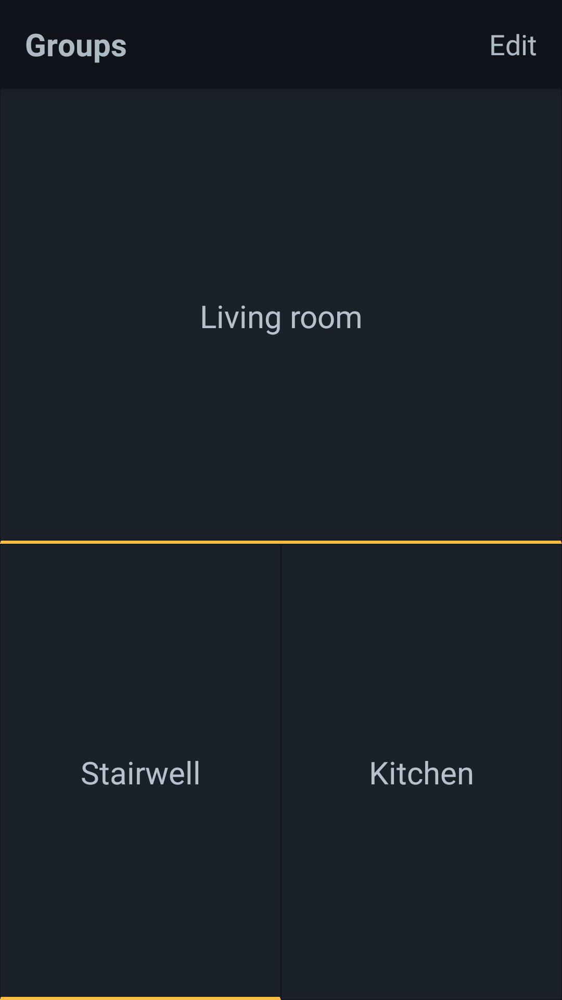

# Luminary
An Android app for managing [Hue lights](https://www2.meethue.com/en-us), focused on speed and configurability.

> Made with [Create React Native App](https://github.com/react-community/create-react-native-app) because I'm lazy.

## Purpose
I've got those fancy wifi lights from Philips. They're awesome, but the published apps don't have what I'm looking for: speed and customization.
Once you replace all your lights, the first thing you need is a better light switch. Since Hue can do a lot more than turn on and off, many apps make toggling a second-rate citizen. The advanced features are polished, but when you just want a light on, it's annoyingly slow.

The first goal of Luminary is to be the best light switch available.

It achieves this in two ways:

### One-touch light toggle
The most common action should be the easiest. Tapping on a group of lights toggles their on/off state.

### Customizable layout
This isn't a normal light switch. It's a light switch for your entire home. With Luminary, you can customize what rooms are shown, where they are on the screen, and the size relative to other rooms.

for example: you could make your whole screen a giant toggle button for your living room, or you could take half your screen for the living room, and split the rest between the kitchen and stairwell. That's the level of control you're given.

## Unique features
Right now the focus is on speed, but here are some plans for the future:
- Scenes: add scene recall. No big surprise here.
- Animation builder: create animations for a set of lights. They'll probably be used like scenes.
- Alarm: configure your phone and light alarms simultaneously. This could be tricky with React Native/Expo...

Also, this isn't really a feature, but the backend uses a [GraphQL server called filament](https://github.com/PsychoLlama/filament). Because of this, I can keep extra data in Postgres, like animations and light usage history. But I haven't yet.

## Using it
This step isn't well polished, but should be straightforward. Open an issue if you run into problems.

- Download and run [filament](https://github.com/PsychoLlama/filament) on the same network as your Hue bridge.
- Then install the app. You can do this two ways:

### Method #1: build logs (Android)
1. Any commit message containing `[expo build]` will contain the link to the APK in [the build logs](https://travis-ci.org/PsychoLlama/luminary). Those builds are usually 10 minutes longer.
2. Get that link to your phone somehow and download it. You can probably figure it out from there (or Google how to sideload an Android app).

### Method #2: compile it yourself
> **Note:** You'll need an [Expo](https://expo.io/) account.

- Clone this repo
- `$ yarn install`
- Log into expo via `$ yarn exp login`
- Compile the app with `$ yarn exp build:android` (`build:ios` should work too, but I've never tried it)
- The compile process isn't fast. You can check the progress via `$ yarn exp build:status`.

I've got some automated tooling which gives me continuous app updates, so I usually don't need this much ceramony. For that reason I (probably) won't expend effort to simplify the process unless someone posts an issue.
